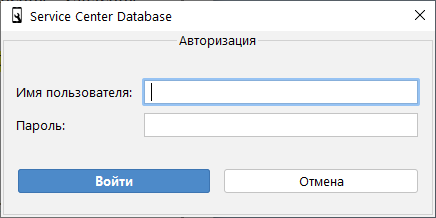
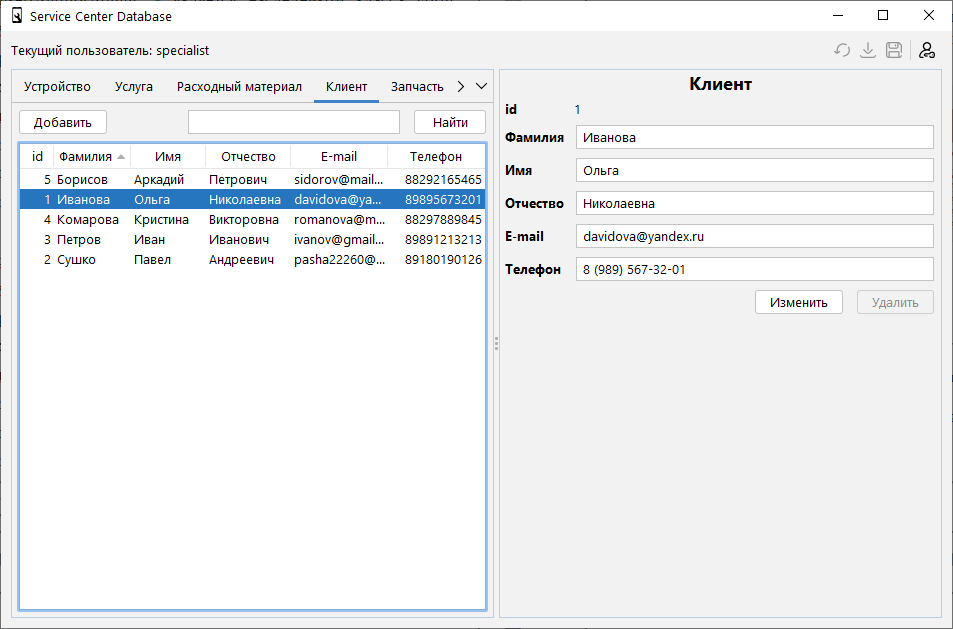

# Auto-buildable database UI

The goal of this project is to dynamically build UIs for PostgreSQL databases. This implementation simulates simple service center database, but it can be repurposed to something else.

## Screenshots

Login form

Main form

